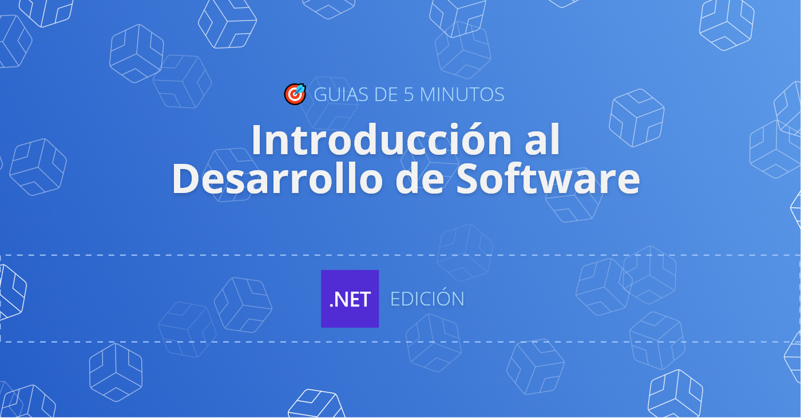
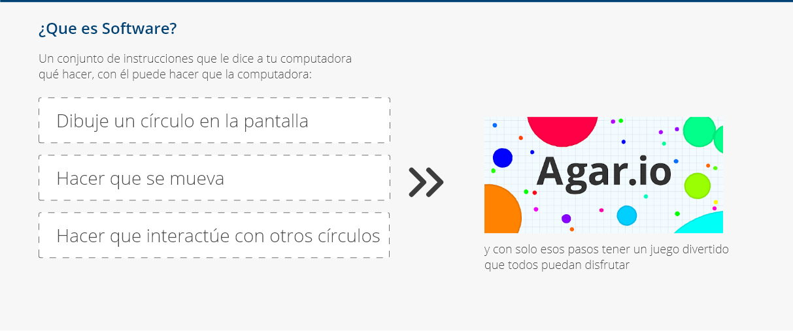
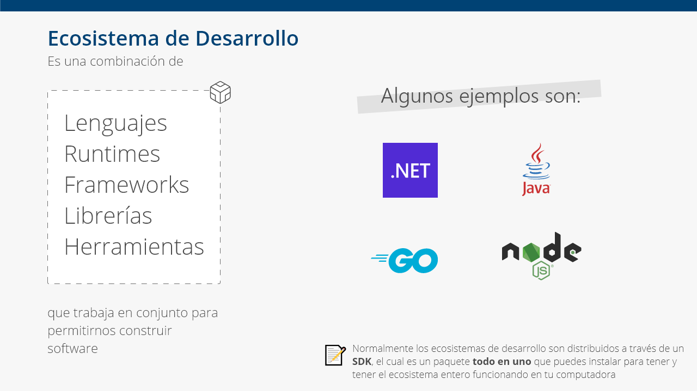

En este artículo vamos a explorar el enorme y apasionante mundo del desarrollo de software, desglosaremos lo que realmente es y cómo podemos empezar en este campo.

Entonces, vamos a comenzar con una de las partes más importantes:

# ¿Que es Software?



Sí, en palabras bastante simples, **software** es solo un conjunto de instrucciones que te permite hacer que tu computadora haga lo que quieras, desde prender las luces de un cuarto hasta interconectar gente en diferentes partes del mundo. Ahora que sabes que es software es probable que te estes preguntando:

# ¿Como puedo crear Software?
Bien, si el software no es nada más que un conjunto de instrucciones, entonces para crearlo necesitamos una forma de escribir tales instrucciones. Como humanos nos hemos ido comunicándonos instrucciones el uno al otro mediante el uso de lo que llamamos "lenguajes" y es precisamente esta la misma forma con la que podremos comunicar instrucciones a las computadoras, aunque en este contexto en vez de llamarlos "lenguajes" los llamaremos **lenguajes de programación**.

## ¿Qué es un lenguaje de programación?
En resumen, un lenguaje de programación es como cualquier otro lenguaje que usamos diariamente para comunicarnos, aun asi lo definiremos como un sistema estructurado con un conjunto de reglas que nos permite construir instrucciones de tal manera que nuestra computadora pueda comprendernos.  

Así como nosotros tenemos varios lenguajes para comunicarnos, en el mundo del software tenemos varios lenguajes de programación entre los que elegir, sin embargo, es muy importante entender que existen dos grandes categorías entre ellos

### Lenguajes de alto nivel y de bajo nivel
Bien, aun cuando en el mundo del software tenemos varios lenguajes de programación, resulta que el único lenguaje que la computadora realmente puede entender es el llamado **Código de máquina**, el cual es un **lenguaje de programación de bajo nivel** y puede verse de la siguiente manera:

```
8B542408 83FA0077 06B80000 0000C383 FA027706 B8010000 
00C353BB 01000000 B9010000 008D0419 83FA0376 078BD989 
C14AEBF1 5BC3
```

Aunque pueda parecer emocionante aprender y comenzar a programar software de esa manera, no es la opción más productiva y, de hecho, es la más difícil. Esa es la razón porque la que grandes mentes han creado lo que llamaremos **lenguajes de programación de alto nivel** que aunque una gran parte de ellos esta escritos en Ingles estos siguen estando mas cerca de nuestro entendimiento por lo cual más fáciles de aprender:


```csharp
Console.WriteLine("Hello World!"); 
Console.WriteLine("The current time is " + DateTime.Now);
```

En este formato y con un poco de conocimiento del Ingles la mayoría de las palabras son fáciles de entender y es precisamente esta característica la que hace facil el desarrollo de software en estos lenguajes, aunque si leíste con atención y ya sepas que las computadoras solo pueden entender **código de máquina**, puede que te preguntes ¿cómo es podemos escribir instrucciones en **lenguajes de alto nivel**? Y la gran respuesta a esto es: con la ayuda de los **compiladores**.

## ¿Que es un Compilador?
En el mundo del software, un compilador es básicamente un traductor, el cual toma el código que escribiste en el lenguaje de programacion de tu elección y lo convierte en código de máquina, de esta manera las computadoras pueden entender lo que deseas que hagan.

Los lenguajes y los compiladores son los componentes básicos para crear software y estaremos hablando más sobre ellos en futuras publicaciones, pero ahora, es momento de comprender que hoy en día para crear software necesitamos más que componentes básicos. Para construirlos, necesitamos completos **ecosistemas** y aunque esto puede parecer aterrador y complejo en realidad son fáciles de usar y nos facilitaran mucho el trabajo.

# Ecosistemas de desarrollo
Expliquemos en palabras simples qué es un ecosistema de desarrollo y cuales son sus componentes:



* **Lenguajes**: Un sistema estructurado con un conjunto de reglas que nos ayuda a comunicar instrucciones a nuestra computadora.

* **Runtimes**: En esencia, es una pieza de software que te permite ejecutar tu código en el dispositivo de tu elección, este es parte del "proceso de compilación" que hace que tu código sea comprensible para la computadora.

* **Frameworks**: Una pieza software ya funcional y altamente flexible que te permite personalizarlo dejandote adjuntar tu propio código en el y asi lograr construir un software de manera aun mas agil.

* **Librerías**: Piezas de código reutilizables y de uso general que se pueden usar repetidamente y que te permiten acelerar el desarrollo de software.

* **Herramientas**: Un conjunto de piezas de software listas para usar que mejoran la calidad de vida del proceso de desarrollo.

¡Hey! ¿dónde queda el compilador en todo esto? Hoy en día el "proceso de compilación" es mucho más complejo, diferentes compiladores pueden estar en diferentes lugares del desarrollo al mismo tiempo, algunos pueden caer en la categoría de herramientas mientras que otros pueden ser parte de los "Runtimes". Aprenderemos más sobre esto en publicaciones futuras.

### Son realmente artos componentes, ¿necesito instalar todas esas cosas?
¡Afortunadamente no! Hoy en día tenemos algo llamado **SDK** o **kit de desarrollo de software** el cual es un paquete todo en uno que podemos instalar para tener todo el ecosistema de nuestra elección en nuestras máquinas.

# El ecosistema .NET
.NET es uno de esos ecosistemas de desarrollo, es multiplataforma, de **código abierto** y con él puedes construir casi cualquier software que te puedas imaginar.


Comenzar con este ecosistema es algo que te llevará 10 minutos o menos, y aunque el tutorial oficial es más que suficiente vamos a repasar los puntos paso a paso:


1️⃣ Descargue e instale el SDK de .NET, pero asegúrese de descargar la versión **.NET Core**, ya que es la más reciente al dia de hoy.

2️⃣ Cree una carpeta donde quiera almacenar su proximo proyecto

3️⃣ Abra esa carpeta en su **Terminal o CMD**.

4️⃣ Para crear un nuevo proyecto .NET ejecute el siguiente comando en su **Terminal o CMD**.

```
dotnet new
```

Una vez ejecutado vera que se han creado dos archivos nuevos en el carpeta que ha creado:

```
📝[nombre-de-tu-carpeta].csproj 
📝 Program.cs
```

* **[nombre-de-tu-carpeta].csproj**: Contiene varias configuraciones, como qué lenguaje de programacion y el Framework que deseas utilizar.

* **Program.cs**: Contiene las instrucciones (codigo) que tu computadora ejecutara. 

5️⃣ Corre tu proyecto ejecutando en tu **Terminal o CMD** el siguiente comando
```
dotnet run
```

Verás que el texto `Hello world!` aparece en tu consola. Felicidades! te has iniciado en el mundo del desarrollo de software.

# Conclusión

El desarrollo de software es un gran mundo con muchas oportunidades y aunque hoy en día hay muchos conceptos y cosas por aprender, si los estudias y observas con atención descubrirás que son fáciles de comprender. Sobre todo, porque la mayoría de estos se inspiraron en las cosas cotidianas que vemos todos los días.